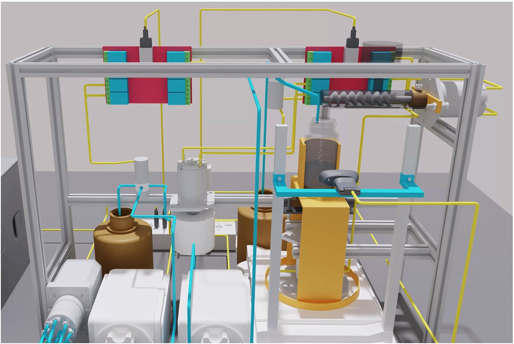
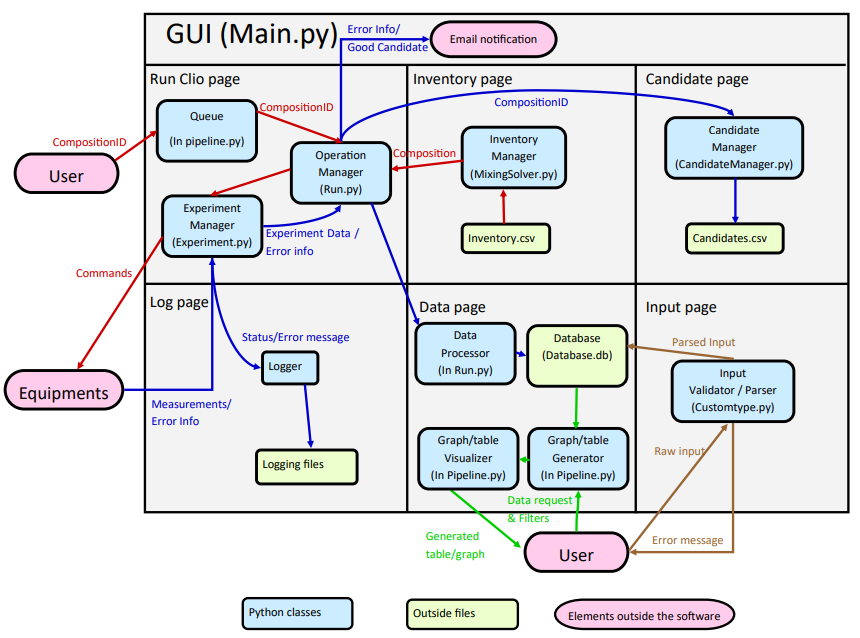

# ElyteOS

**Version:** 1.0.1  
**Authors:** Yuhan Chen, Hongyi Lin, Tianyi Zhang  
**License:** MIT  
**Repository/Website:** https://github.com/yuhanchen0711/EEG-Clio-Master/

## Overview
ElyteOS is a graphical user interface written in Python 3.8.3 which en-
ables the automation of the process of electrolyte preparation, measurement,
data storage, and data visualization. It provides a user-friendly interface
and act as a framework for automating lab equipment with different com-
mands as well as managing the procedure of the experiments. Meanwhile,
ElyteOS automatically saves the experiment data into a database and provide
data searching and visualization for researchers. ElyteOS not only facili-
tates electrolyte researches but also provides potential in optimizing battery
performance and advancing energy storage technologies.

---

## Installation Instructions

### Hardware Prerequisites
The following table contains all the lab equipments to be used:

| Component | Brand | Number | Use | Communication | Connection to Computer |
|------------------|-----------------|-----------------|------------------|-----------------|-----------------|
| 10-port valve | VICI Valco | 3 | valve for feeder solutions | RS232 serial | USB type B to USB type A |
| balance | Radwag AS 220.R2 Plus | 1 | weight measurement | RS232 serial | USB type B to USB type A |
| pump | Longer L100-1S-2 | 2 | liquid transportation | RS485 serial | DB15 female to USB type A |
| 3-way valve | Cole-Parmer | 4 | liquid direction control | NA (connected to relay) | N/A (connected to relay)|
| 24V relay | Songle 24V 8 channels | 1 | 3-way valve control | HID | USB type B to USB type A |
| 2-way solenoid valve | Beduan | 1 | cleaning gas direction control | N/A (connected to relay) | N/A (connected to relay) |
| 12V relay | Songle 12V 8 channels | 1 | 2-way valve control | HID | USB type B to USB type A |
| viscometer | Brookfield DV-II+ Pro | 1 | viscosity measurement | RS232 serial | DB9 female to USB type A |
| potentiostat | PalmSens4 | 1 | electrochemical measurement | RS232 serial | USB type C to USB type A |
| thermometer | Elitech LogEt5TE | 1 | temperature measurement | HID | USB type A |
| motor | Kamoer NKP | 1 | mixing the solution | N/A (connected to relay) | N/A (connected to relay) |

### Hardware Setup
The following images are an overview of the lab equipments setup:



### Software Prerequisites
- Operating System: Windows 10
- Python Version: Python 3.8 or higher

### Installation steps
- 1. Open a terminal and navigate to the directory of the current project folder.
- 2. In your terminal, install all the required packages.
  ```bash
  pip install -r requirements.txt
  ```
- 3. Go to device manager, look for COM ports for serial devices and HID path for HID devices
     Then go to Utils.py and change them accordingly.
     
## Software Architecture


## Usage
### Key Features
- Provide a completely automated pipeline for lab equipment to conduct experiments.
- Automatically store all the data into a secured database.
- Allows the users to perform data retrival, visualization, and filtering easily.

### How to run
- 1. Open a terminal and navigate to the directory of the current project folder.
- 2. Inside the terminal, run the following command:
  ```bash
  python Main.py
  ```
Access the user interface through the browser at http://localhost:8050.

### Access the database
- After launching the interface, click on Data page. Select all the properties of electrolyte and (optionally, the min and max value) of the properties. Then click "show table" or "show graphs" to visualize the data.

- If you want to add data to the database, click on "Input Data" page. After that, manually enter the data with the shown properties. Make sure the data is correct because the data cannot be deleted. Entering the data by uploading a CSV file is also allowed. Please make sure the CSV file has all the columns listed on the "Input Data" page!

### Run experiment
- Click on "Run Clio" page. Input the compositionID to measure the desired properties of the electrolyte, and click on "Add to queue". The equipments will automatically start if there is something inside the queue.

- You can also upload compositionIDs through CSV file. Make a CSV file with a list of compositionIDs in one column, then upload into the server.

- If the interface shows "cannot make desired solution", please go to the "Inventory" page to check whether the inventory is feasible for the desired solution. You can also navigate to /src/Equipment_Control/Inventory.csv to view and modify the inventory. You should also navigate to /src/Database/Solvent Molar mass.csv or /src/Database/Salt Molar mass.csv to check whether all the solvents and salts are inside the system.

### CompositionID
A compositionID consists of four sections. The first section represents the solvent types being used; the second section represents the mass fraction of each type of solvent in the mixture, respectively; the third section represents the salt being used in the
electrolyte and the final one represents the molality of each type of salt in the mixture, respectively. The sections are separated with a bar, and the items in the same section are separated with an underscore. 

For example, the electrolyte solution with 60% DMC and 40% EMC in the solvent and LiPF6 and LiFSI with 1 mol/kg and 1.5 mol/kg, respectively, should have the CompositionID as DMC_EMC|60_40|LiPF6_LiFSI|1_1.5. 

## Video Demo
[](https://www.youtube.com/watch?v=OK6PHi21mSU)

## License
The code is licensed under MIT.

## Adopted Code
This project includes code that was adopted from the following sources:

1. **PalmSens SDK**
   - Description: This project adopts this piece code for conductivity measurement.
   - Link: https://we.tl/t-CyTcpT4o1k
   - License: MIT
